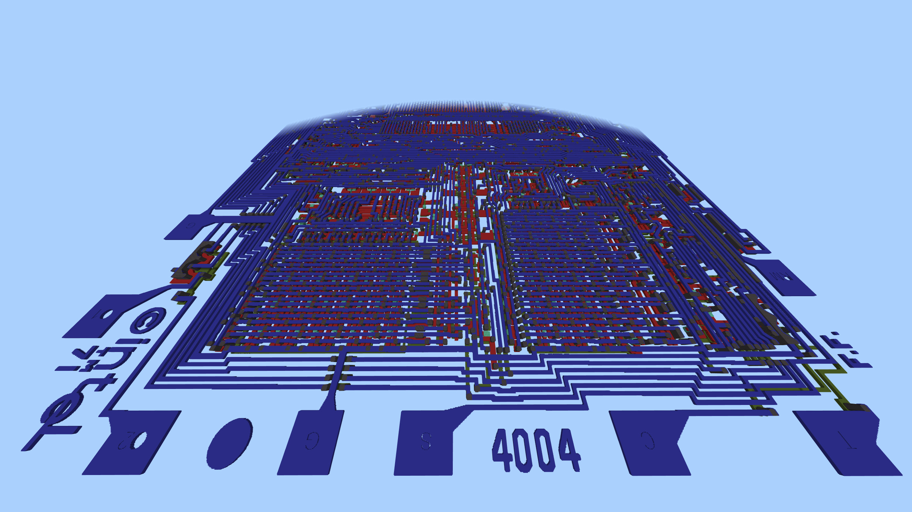

# I4004-CPU-Minecraft

A conversion of the CPU specification of the I4004 CPU into a macro scale in minecraft.
Makes use of the Chip to minecraft project: [ChipToMinecraft.Net](https://github.com/DaanV2/ChipToMinecraft.Net)

## License
This repository makes use of the provided license by the www.4004.com website [see license](./data/license.txt)

## Data
Data sources: 
- http://www.4004.com
- http://www.intel4004.com/